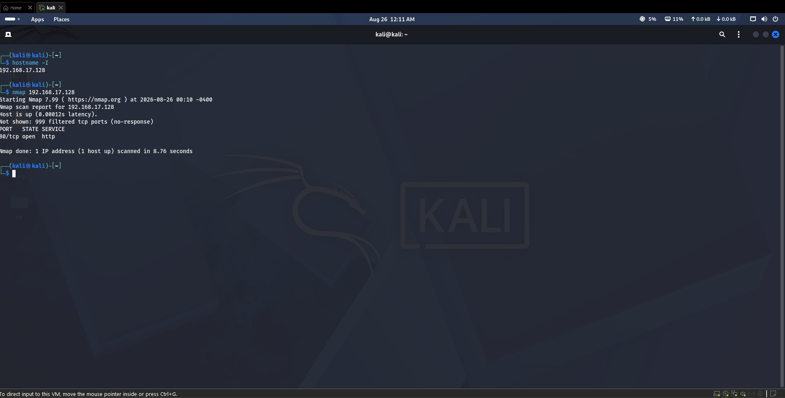
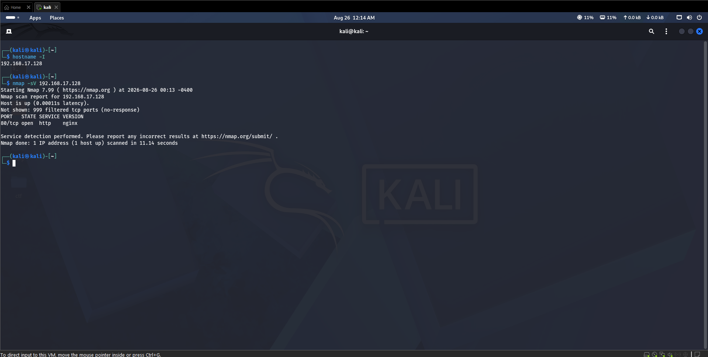
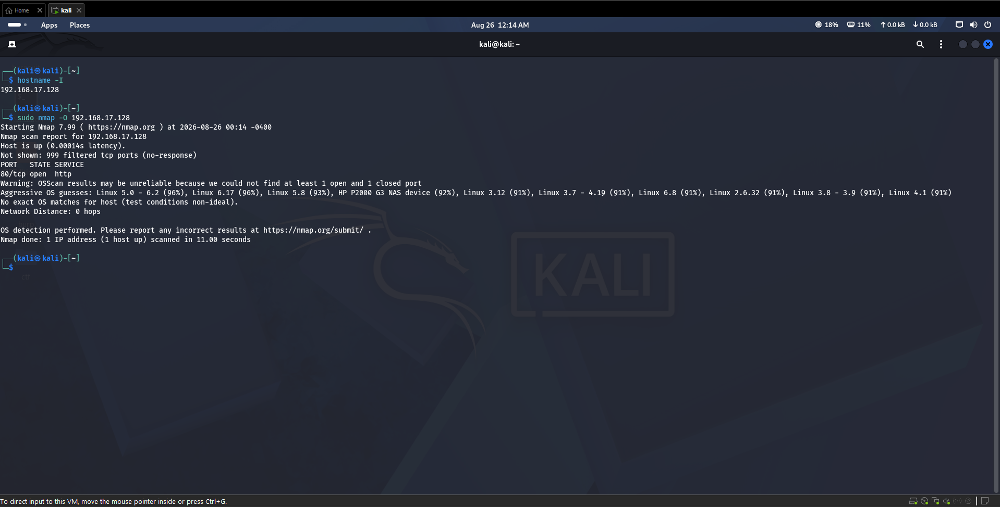

# Task 1 — Basic Network Scanning with Nmap

## 1. Project Overview

This project demonstrates basic network scanning and security analysis using **Nmap (Network Mapper)**.

The objective is to identify open ports and services running on a controlled virtual machine, determine service information, perform operating-system detection, and analyze the security implications of the exposed services.

All scanning activities were performed in a controlled environment for educational purposes.

---

## 2. Objective

The objectives of this project are:

* Install and verify Nmap.
* Perform a basic network scan.
* Identify open ports on the target machine.
* Identify services running on open ports.
* Perform service and version detection.
* Perform operating-system detection.
* Analyze the security risks associated with discovered services.
* Document the results and findings.
* Maintain screenshots of the Nmap scans.

---

## 3. Tools and Technologies

| Tool            | Purpose                                 |
| --------------- | --------------------------------------- |
| Kali Linux      | Security testing environment            |
| Nmap            | Network discovery and security auditing |
| Virtual Machine | Controlled target environment           |
| GitHub          | Project documentation and submission    |

---

## 4. What is Nmap?

Nmap, short for **Network Mapper**, is an open-source tool used for network discovery and security auditing.

It can be used to:

* Discover active hosts.
* Identify open and closed ports.
* Detect services running on ports.
* Determine service and software information.
* Perform operating-system detection.
* Assist security professionals in identifying exposed network services.

Nmap is widely used by network administrators and security professionals for authorized security assessment and troubleshooting.

---

## 5. Why Network Scanning Matters

Network scanning helps administrators understand which services are accessible on a system.

An unnecessarily exposed service can increase the system's attack surface. By identifying open ports, administrators can determine whether a service is required and whether it has been securely configured.

Network scanning can help with:

* Identifying unnecessary services.
* Detecting unexpected network exposure.
* Understanding the attack surface.
* Supporting security audits.
* Verifying firewall configurations.
* Identifying services that may require additional security controls.

An open port does not automatically mean that a system is vulnerable. The actual risk depends on the service, software version, configuration, authentication controls, and the application behind the service.

---

## 6. Nmap Installation

Nmap was used in the Kali Linux environment.

The Nmap installation was verified using:

```bash
nmap --version
```

If Nmap is not already installed on a Debian-based Linux system, it can be installed using:

```bash
sudo apt update
sudo apt install nmap
```

After installation, the installation can be verified with:

```bash
nmap --version
```

---

## 7. Target Environment

The scans were performed against a controlled virtual-machine environment.

**Target IP:**

```text
192.168.17.128
```

The target was used only for authorized educational testing.

---

## 8. Scanning Methodology

Three Nmap scans were performed.

### 8.1 Basic Scan

Command:

```bash
nmap 192.168.17.128
```

Purpose:

The basic scan was used to identify accessible TCP ports and the services commonly associated with those ports.

### 8.2 Service and Version Detection

Command:

```bash
nmap -sV 192.168.17.128
```

Purpose:

The `-sV` option enables service and version detection. It attempts to identify the software providing a network service.

### 8.3 Operating System Detection

Command:

```bash
sudo nmap -O 192.168.17.128
```

Purpose:

The `-O` option attempts to identify the operating system of the target based on network responses.

---

## 9. Scan Results

### Basic Scan

The basic scan identified the following open port:

```text
80/tcp   open   http
```

The scan also reported:

```text
999 filtered TCP ports
```

### Service Version Scan

The service/version scan identified:

```text
80/tcp   open   http   nginx
```

Nmap identified **nginx** as the software providing the HTTP service, but it did not identify a specific nginx version.

### OS Detection

The OS detection scan did not provide an exact operating-system match.

Nmap's strongest guesses were Linux-based systems, including:

```text
Linux 5.0 - 6.2 (96%)
Linux 6.17 (96%)
Linux 5.8 (93%)
```

However, Nmap warned that the OS detection results may be unreliable because it could not find at least one open and one closed port.

Therefore, the OS result is treated as an estimate rather than a confirmed operating system.

---

## 10. Open Port Analysis

### Port 80 — HTTP

**Port:** `80/tcp`

**Service:** HTTP

**Software:** nginx

### Purpose

TCP port 80 is commonly used for HTTP web traffic. In this scan, Nmap identified nginx as the software providing the HTTP service.

Nginx is commonly used as a web server and reverse proxy.

### Security Considerations

An open HTTP port is not automatically a vulnerability.

However, HTTP does not provide encryption by itself. If sensitive information is transmitted over HTTP, it may be exposed to interception on an untrusted network.

The security of the service also depends on:

* Nginx configuration.
* Nginx software version.
* Web application security.
* Authentication controls.
* Firewall rules.
* Information exposed by the web server.

### Security Recommendations

Possible security improvements include:

* Use HTTPS for sensitive web traffic.
* Keep nginx and the underlying operating system updated.
* Disable unnecessary services.
* Apply secure web-server configuration.
* Restrict administrative interfaces.
* Use firewall rules to limit unnecessary network access.
* Monitor exposed services regularly.

---

## 11. OS Detection Analysis

Nmap reported that its OS detection results could be unreliable because it could not find both an open and a closed port.

The strongest guesses were Linux-based operating systems, with a maximum reported confidence of 96%.

The result should therefore be interpreted as:

> Nmap strongly suspected a Linux-based operating system, but the exact OS could not be confirmed by this scan.

This demonstrates an important limitation of automated OS detection: scan conditions and network filtering can affect the accuracy of fingerprinting.

---

## 12. Security Findings Summary

| Finding                     | Observation               |
| --------------------------- | ------------------------- |
| Host availability           | Target host was reachable |
| Open TCP ports              | 1                         |
| Open port                   | 80/tcp                    |
| Service                     | HTTP                      |
| Web server                  | nginx                     |
| Specific nginx version      | Not detected              |
| Filtered ports              | 999                       |
| OS detection                | Inconclusive              |
| Main security consideration | Unencrypted HTTP exposure |

---

## 13. Screenshots

The Nmap terminal outputs are included in the `screenshots` directory.

### Basic Scan



### Service Version Scan



### OS Detection Scan



---

## 14. Ethical Use

Nmap must only be used against systems that you own or have explicit permission to test.

Unauthorized scanning of external, production, or third-party systems can violate organizational policies and applicable laws.

All scanning performed for this project was conducted in a controlled environment for educational and authorized security-testing purposes.

---

## 15. Conclusion

The Nmap assessment identified one open TCP service on the target system: **port 80 running HTTP through nginx**.

The service detection scan successfully identified nginx, although a specific software version was not detected.

The OS detection scan produced Linux-based guesses but could not provide a reliable exact operating-system match because the scan did not identify both open and closed ports.

The assessment demonstrates how Nmap can be used to identify exposed network services and support basic security analysis. The primary security consideration identified in this assessment is the availability of an HTTP service, where HTTPS should be considered when protecting sensitive web traffic.

---

## 16. Project Files

```text
PatelParv_Task1/
│
├── README.md
├── nmap_scan_results.txt
│
└── screenshots/
    ├── basic_scan.png
    ├── service_scan.png
    └── os_scan.png
```
